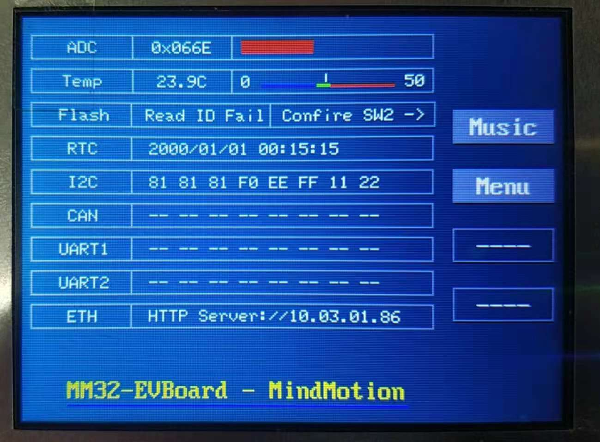
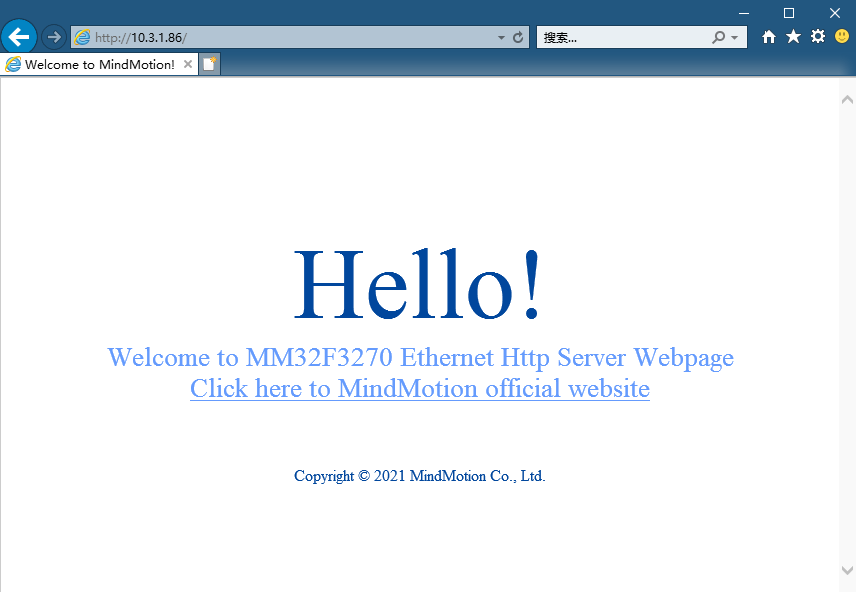

# MB039 EVBOARD 出厂说明

## 开发板简介

MB039 为 MM32F3270系列开发板，板载芯片为 MM32F3277G9P

## 出厂程序说明
1. LED 灯

    上电后，LD1（红）LD2（绿）LD3（蓝）LD4（橙）闪烁两次后流水灯循环。速度由RV1控制

2. 蜂鸣器
   
    上电后，蜂鸣器滴滴两声后进入音乐播放模式，如需关闭，可在任意时刻按键 K1 取消和开启

3. Key 按键
   
    K1-K4 按键功能由 LCD 屏显决定。包含音乐控制、通信模式选择、时钟调整、以太网DHCP功能

4. LCD 屏
   
   上电后刷新屏幕，显示品牌LOGO，500ms后进入就绪态，屏显内容包含温度、RV数值、FLASH 厂商 ID、RTC实时时钟、各项通信数据（I2C、CAN、UART1、UART2、ETH 等信息）

5. RV 电位器
    
    电位器可调整 LED 跑马灯速度，并在LCD屏第一栏动态显示

6. CN5 以太网RJ45接口
   
   开发板连接网线后，按键 Key4 开启 HTTP 服务，同时 DHCP 开启，LCD屏显当前分配的 IP 地址（最后一栏）

   

   用户可在浏览器中输入该 IP 地址进行访问。界面如下:

   
   `注意事项： 拨码开关 SW2 中控制 SPI-FLASH / ETH 冲突引脚。请拨至左边`